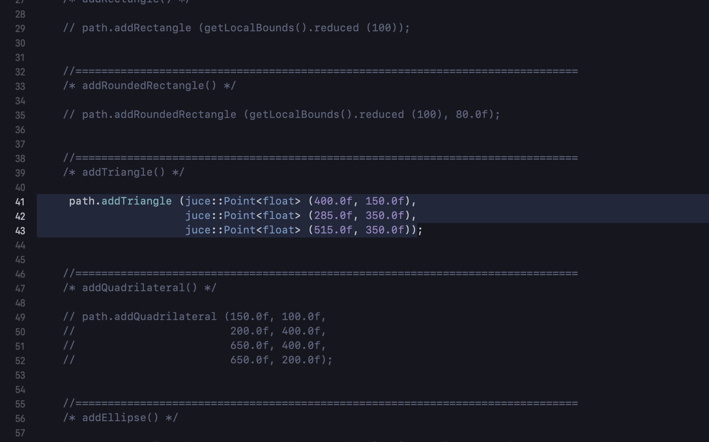
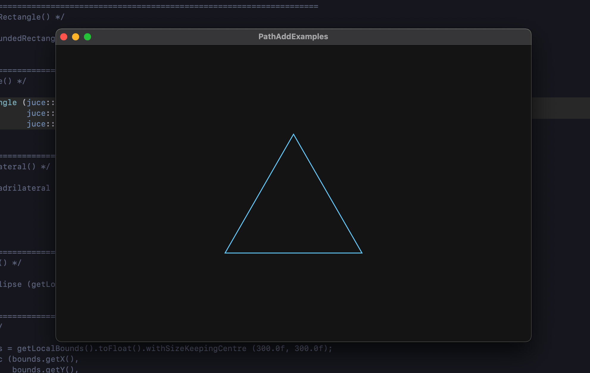

# juce::Path::add* Examples

This is the JUCE project that allows you to visually and quickly check examples using the juce::Path::add* functions.

## Usage

Uncomment the line of code you want to check.

## Others
- [juce::Path::add* Examples](https://suzuki-kengo.dev/posts/juce-path-add-examples)
- [juce::Graphics::draw* Examples](https://suzuki-kengo.dev/posts/juce-graphics-draw-examples)
- [juce::Rectangle](https://suzuki-kengo.dev/posts/juce-rectangle-samples)
